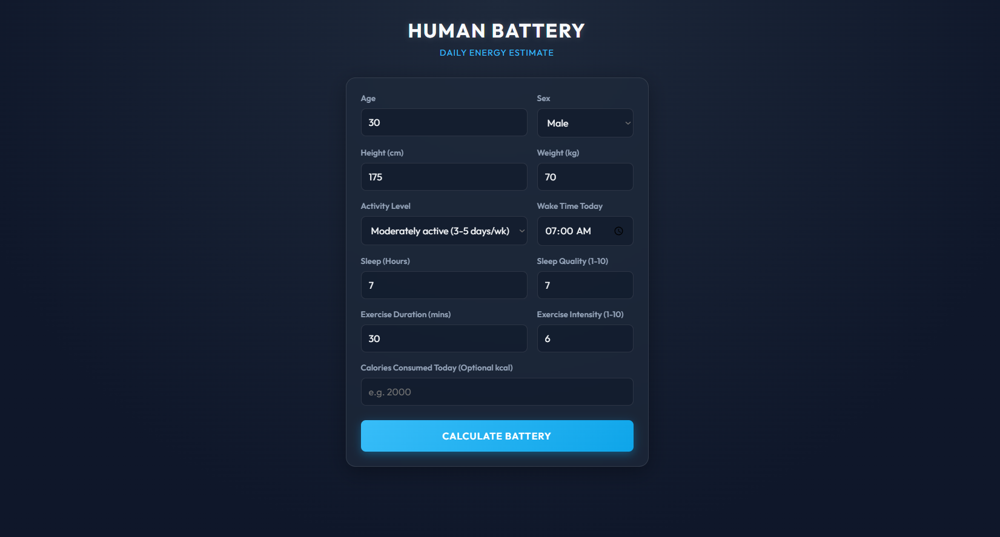
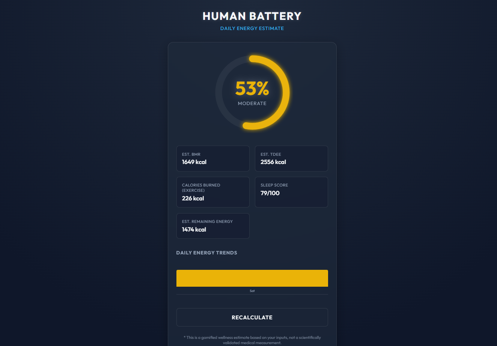

# HUMAN BATTERY CALCULATOR 🎯

## Basic Details
### Team Name: MAKERS

### Team Members
- Team Lead: Janaki Remesh - College of Engineering Allapuzha

### Project Description
A gamified web application that estimates a person's daily "Human Battery" percentage based on factors such as age, weight, sleep, and exercise. It calculates an energy estimate and presents the result through a simple visual battery gauge, making everyday energy levels easy and fun to understand.

### The Problem (that doesn't exist)
Humans have batteries too — we just forgot to check where the charging port is! People often wonder why they feel energetic one day and completely drained the next, but there is no simple "battery percentage" for humans.

### The Solution (that nobody asked for)
We created the Human Battery Calculator — a fun web app that turns basic lifestyle information into a human battery percentage. Enter your details, calculate your energy level, and find out whether your internal battery is fully charged or desperately looking for a charger. 🔋

## Technical Details
### Technologies/Components Used
For Software:

HTML5
CSS3
JavaScript
Vanilla DOM Manipulation
Browser LocalStorage
VS Code
GitHub

For Hardware:

Laptop/Desktop
Keyboard and mouse
No additional hardware components required
Implementation

For Software:

Installation

No installation or additional dependencies are required.

Clone the repository and open the project folder:

git clone https://github.com/janakiremesh30-stack/Human-battery-calculator.git
cd Human-battery-calculator
Run

Open index.html directly in a web browser.

Enter the required details such as age, weight, sleep, and exercise information, then click Calculate Battery to view the estimated human battery percentage.

Project Documentation

For Software:

# Screenshots

This screenshot shows the input page where the user enters their age, weight, sleep, and exercise details before calculating their human battery level.

This screenshot shows the calculated human battery percentage and the resulting energy information displayed by the application.

# Diagrams
The workflow shows how the user's lifestyle information is entered, processed by the JavaScript calculation logic, and converted into a human battery percentage displayed through the result interface.

Schematic & Circuit

Not applicable — the project is completely software-based and does not require an electronic circuit.

Not applicable — there is no hardware schematic for this project.

Build Photos

The project does not use physical hardware components.

The application was developed as a browser-based web application using HTML, CSS, and JavaScript.

The final product is the working Human Battery Calculator web application.

Project Demo
The project repository contains the complete source code and can be used to run the Human Battery Calculator directly in a web browser.

Team Contributions
Janaki Remesh: Designed and developed the Human Battery Calculator, including the user interface, battery calculation logic, JavaScript functionality, styling, local storage, and testing.

Made with ❤️ at TinkerHub Useless Projects

